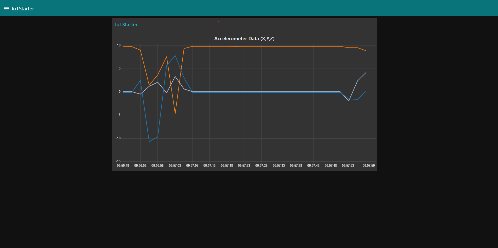

<!-- PROJECT SHIELDS -->
<!--
*** I'm using markdown "reference style" links for readability.
*** Reference links are enclosed in brackets [ ] instead of parentheses ( ).
*** See the bottom of this document for the declaration of the reference variables
*** for contributors-url, forks-url, etc. This is an optional, concise syntax you may use.
*** https://www.markdownguide.org/basic-syntax/#reference-style-links
-->
[![Contributors][contributors-shield]][contributors-url]
[![Forks][forks-shield]][forks-url]
[![Stargazers][stars-shield]][stars-url]
[![Issues][issues-shield]][issues-url]
[![MIT License][license-shield]][license-url]
[![LinkedIan][linkedin-shield]][linkedin-url]

<!-- PROJECT LOGO -->
 

  

  <h3 align="center">IoT Starter for Android</h3>

  

    This is an IoT starter project to send phone's accelerometer data to NodeRED over MQTT.
     
   
  

<!-- TABLE OF CONTENTS -->

  
Table of Contents

  <ol>
    <li>
      <a href="#about-the-project">About The Project</a>
      <ul>
        <li><a href="#built-with">Built With</a></li>
      </ul>
    </li>
    <li>
      <a href="#getting-started">Getting Started</a>
      <ul>
        <li><a href="#prerequisites">Prerequisites</a></li>
        <li><a href="#installation">Installation</a></li>
      </ul>
    </li>
    <li><a href="#usage">Usage</a></li>
    <li><a href="#roadmap">Roadmap</a></li>
    <li><a href="#contributing">Contributing</a></li>
    <li><a href="#license">License</a></li>
    <li><a href="#contact">Contact</a></li>
    <li><a href="#acknowledgments">Acknowledgments</a></li>
  </ol>

<!-- ABOUT THE PROJECT -->
## About The Project

There are a number of IoT Starter Projects out there for you to explore. The purpose of this project is to provide you with an easy to use example of an IoT Project with the latest tech-trends in IoT space. This project doesn't require any hardware and make use of your Android Smartphone accelerometer sensor.

How it works?

This project has 3 parts.
* An android smartphone app to collect phone accelerometer data and send it to node-red dashboard over MQTT.
* An MQTT Broker(running on a Ubuntu Server) to receive data from smartphone app and forward it to NodeRED dashboard for visualization.
* A NodeRED app running on IBM Cloud to visualize the accelerometer data in real-time.

Once you run this project succesfully, you will be able to implement same set of instructions on your next IoT project.

(<a href="#top">back to top</a>)

### Built With

IoT Starter is built with

* [Android Studio](https://developer.android.com/studio)
* [NodeRED](https://nodered.org/)
* [Mosquitto](https://mosquitto.org/)
* [IBM Cloud](https://www.ibm.com/cloud)

(<a href="#top">back to top</a>)

<!-- GETTING STARTED -->
## Getting Started

This section provides a set of instructions on how to run this project.

### Prerequisites

This is a list things you need have.

* Android Studio(optional)
* IBM Cloud Account

### Installation

1. Compile the andorid app or use APK file and install it on your smartphone.
2. Make a Classic Ubuntu Server 20.04 instance in your IBM Cloud account and install mosquitto broker on it.
3. Install NodeRED in your IBM Cloud Account
4. Install node-red-dashboard in your NodeRED instance.
5. Import the flow from NodeREDDashboard folder of this repository into your NodeRED dashboard.

(<a href="#top">back to top</a>)

<!-- USAGE EXAMPLES -->
## Usage

Install the compiled android app on your Android Phone and in settings page put the public IP address of your Ubuntu Server 20.04 instance as a broker address and in the topic you can put ``data/val/accelerometer`` and then on the homepage of the app you can press start to start sending the data to the dashboard.

You can visulaize the data on the NodeRED dashboard ui page usually at the address ``http://appURL/ui``

(<a href="#top">back to top</a>)

<!-- ROADMAP -->
## Roadmap

- [x] Add Android App
- [ ] Add iOS App
- [ ] Add a standalone hardware example.

(<a href="#top">back to top</a>)

<!-- CONTRIBUTING -->
## Contributing

Contributions are what make the open source community such an amazing place to learn, inspire, and create. Any contributions you make are **greatly appreciated**.

If you have a suggestion that would make this better, please fork the repo and create a pull request. You can also simply open an issue with the tag "enhancement".
Don't forget to give the project a star! Thanks again!

1. Fork the Project
2. Create your Feature Branch (`git checkout -b feature/AmazingFeature`)
3. Commit your Changes (`git commit -m 'Add some AmazingFeature'`)
4. Push to the Branch (`git push origin feature/AmazingFeature`)
5. Open a Pull Request

(<a href="#top">back to top</a>)

<!-- LICENSE -->
## License

Distributed under the Eclipse Public License 1.0 License. See `LICENSE` for more information.

(<a href="#top">back to top</a>)

<!-- CONTACT -->
## Contact

NaumanShakir - [NaumanShakir.com](https://NaumanShakir) - [@Nauman3S](https://twitter.com/Nauman3S) - NaumanShakir3s@gmail.com

Project Link: [https://github.com/Nauman3S/iot-starter-android](https://github.com/Nauman3S/iot-starter-android)

(<a href="#top">back to top</a>)

<!-- MARKDOWN LINKS & IMAGES -->
<!-- https://www.markdownguide.org/basic-syntax/#reference-style-links -->
[contributors-shield]: https://img.shields.io/github/contributors/Nauman3S/iot-starter-android
[contributors-url]: https://github.com/Nauman3S/iot-starter-android/graphs/contributors
[forks-shield]: https://img.shields.io/github/forks/Nauman3S/iot-starter-android
[forks-url]: https://github.com/Nauman3S/iot-starter-android/network/members
[stars-shield]: https://img.shields.io/github/stars/Nauman3S/iot-starter-android
[stars-url]: https://github.com/Nauman3S/iot-starter-android/stargazers
[issues-shield]: https://img.shields.io/github/issues/Nauman3S/iot-starter-android
[issues-url]: https://github.com/Nauman3S/iot-starter-android/issues
[license-shield]: https://img.shields.io/github/license/Nauman3S/iot-starter-android
[license-url]: https://github.com/Nauman3S/iot-starter-android/blob/main/LICENSE
[linkedin-shield]: https://img.shields.io/badge/-LinkedIn-black.svg?style=for-the-badge&logo=linkedin&colorB=555
[linkedin-url]: https://linkedin.com/in/naumanshakir3s
[product-screenshot]: images/scr17.png